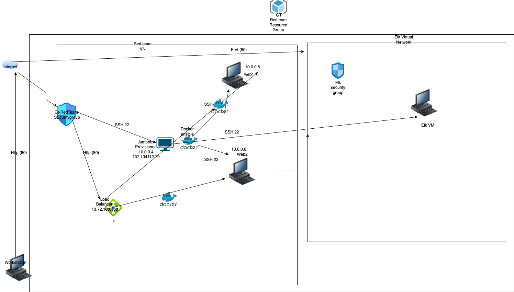

## Automated ELK Stack Deployment

The files in this repository were used to configure the network depicted below.

These files have been tested and used to generate a live ELK deployment on Azure. They can be used to either recreate the entire deployment pictured above. Alternatively, select portions of the _yaml____ file may be used to install only certain pieces of it, such as Filebeat.

  - my-playbook.yaml 
  - installelk-playbook.yml
  - filebeat-playbook.yml 
  - metricbeat-playbook.yml

This document contains the following details:
- Description of the Topology
- Access Policies
- ELK Configuration
  - Beats in Use
  - Machines Being Monitored
- How to Use the Ansible Build

### Description of the Topology

The main purpose of this network is to expose a load-balanced and monitored instance of DVWA, the D*mn Vulnerable Web Application.

Load balancing ensures that the application will be highly available, in addition to restricting access to the network.
- What aspect of security do load balancers protect? Prevent the network from a single point of failure.By routing user requests evenly across a group of servers, load balancers minimize the likelihood of downtime. They do this by rerouting traffic to other servers in the group if one should fail.
-  What is the advantage of a jump box? Jump box is the only machine that can connect to the web servers.

Integrating an ELK server allows users to easily monitor the vulnerable VMs for changes to the _____ and system _____.
- What does Filebeat watch for? Changes the system log
- What does Metricbeat record? Record system metric like cpu.

The configuration details of each machine may be found below.
_Note: Use the [Markdown Table Generator](http://www.tablesgenerator.com/markdown_tables) to add/remove values from the table_.

| Name     | Function | IP Address | Operating System |
|----------|----------|------------|------------------|
| Jump Box | Gateway  | 10.0.0.4   | Linux            |
<<<<<<< HEAD
| Web-1   |  Server   | 10.0.0.5   | Linux      |
| Web-2    | Server   |  10.0.0.6    | Linux           |
| Elk-Server| Server   | 10.1.0.4|  Linux           |
=======
| Web-1   |  Server   | 10.0.0.5   | Linux      |      
| Web-2    | Server   |  10.0.0.6    | Linux           |                  
| Elk-Server| Server   | 10.1.0.4|  Linux           |                  
>>>>>>> 2097e7496122d3729b996f6a64ce38d36afa3076

### Access Policies

The machines on the internal network are not exposed to the public Internet. 

Only the Jump box machine can accept connections from the Internet. Access to this machine is only allowed from the following IP addresses:
- Add whitelisted IP addresses: 78.260.164.107

Machines within the network can only be accessed by Jumpbox Provisioner.
- Which machine did you allow to access your ELK VM? What was its IP address? 10.0.0.4

A summary of the access policies in place can be found in the table below.

| Name     | Publicly Accessible | Allowed IP Addresses |
|----------|---------------------|----------------------|
| Jump Box | Yes              |  78.260.164.107|
| Web-1    | NO                    | 10.0.0.4                     |
| Web-2    |   NO |10.0.0.4 |
| Elk_Server|    NO                 |10.0.0.4|

### Elk Configuration

Ansible was used to automate configuration of the ELK machine. No configuration was performed manually, which is advantageous because...
<<<<<<< HEAD
- Configuration management, single source for application deployment.

The playbook implements the following tasks:
=======
- _TODO: What is the main advantage of automating configuration with Ansible?_
- Configuration management, single source for application deployment.

The playbook implements the following tasks:
- _TODO: In 3-5 bullets, explain the steps of the ELK installation play. E.g., install Docker; download image; etc._
>>>>>>> 2097e7496122d3729b996f6a64ce38d36afa3076
- Check the presence of docker (Install/Update)
- Check the presence of python3-pip (Install/Update)
- Increase virtual memory
- Download and install docker elk container

The following screenshot displays the result of running `docker ps` after successfully configuring the ELK instance.

### Target Machines & Beats
This ELK server is configured to monitor the following machines:
- Monitor web1 and web2

We have installed the following Beats on these machines:
- Filebeat and Metricbeat

These Beats allow us to collect the following information from each machine:
- _Machine health, performance, system logs, and events.

### Using the Playbook
In order to use the playbook, you will need to have an Ansible control node already configured. Assuming you have such a control node provisioned: 

SSH into the control node and follow the steps below:
<<<<<<< HEAD
- copy the install-elk.yml playbook to the /etc/ansible
- update host file with ip address you want playbook to run on
=======
- Copy the filebeat file to file-config.yml.
- Update the _____ file to include...
>>>>>>> 2097e7496122d3729b996f6a64ce38d36afa3076
- Run the playbook, and navigate to ____ to check that the installation worked as expected.

_TODO: Answer the following questions to fill in the blanks:_
- _Which file is the playbook? Ansible-playbook files 
- Where do you copy it? Root of ansible
- _Which file do you update to make Ansible run the playbook on a specific machine? Hosts configuration file
-  How do I specify which machine to install the ELK server on versus which to install Filebeat on? HostName in Host configuration file
<<<<<<< HEAD
- _Which URL do you navigate to in order to check that the ELK server is running? http://elk.vm.pub.ip:5601/app/kibana

_As a **Bonus**, provide the specific commands the user will need to run to download the playbook, update the files, etc._

r
=======
- _Which URL do you navigate to in order to check that the ELK server is running?

_As a **Bonus**, provide the specific commands the user will need to run to download the playbook, update the files, etc._
>>>>>>> 2097e7496122d3729b996f6a64ce38d36afa3076
